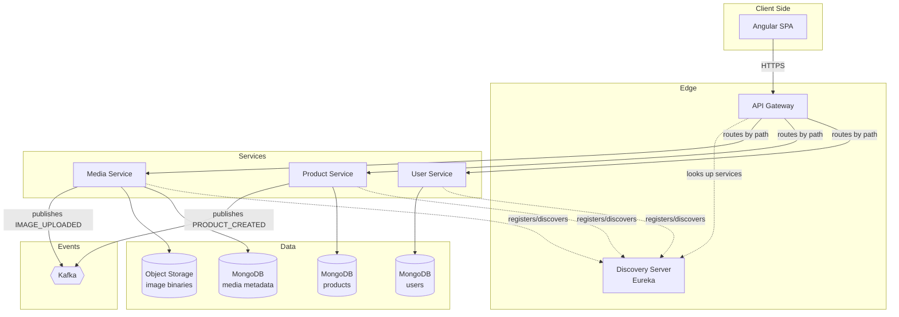
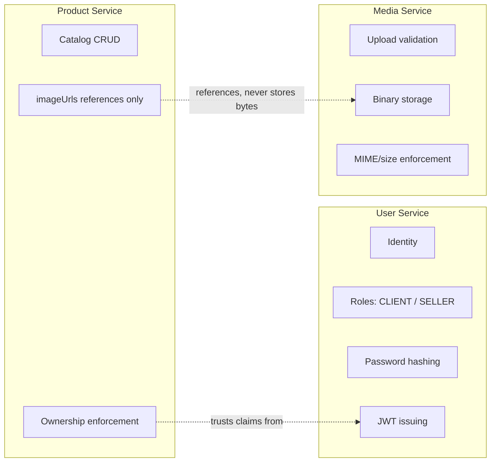
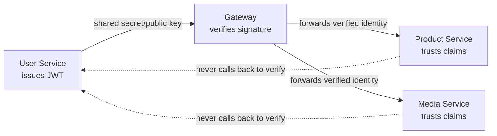
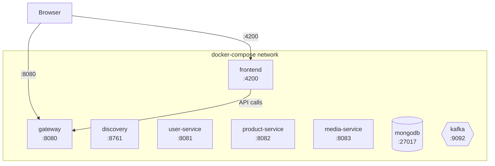

# Buy01 — System Architecture

A deep walkthrough of how the pieces fit together: what runs where, what talks to what, and why the boundaries are drawn the way they are.

---

## 1. High-Level Architecture



**Read this diagram as two separate concerns layered on top of each other:**
- **Solid arrows** = the request path. The frontend never talks to a service directly — everything goes through the Gateway.
- **Dotted arrows** = discovery. Services don't know each other's IP/port; they register a name with Eureka, and the Gateway resolves that name at request time. This is what lets you restart, scale, or move a service without reconfiguring anyone else.

Each service also owns its own slice of MongoDB (logically — could be separate databases or separate collections depending on your setup) and never reaches into another service's data directly. If Product Service needs something from User Service, it asks over HTTP, not by querying the User Service's database.

---

## 2. Repository Structure

```
buy01/
├── discovery-server/            # Eureka — service registry
│   └── src/main/java/.../DiscoveryApplication.java
│
├── gateway/                     # Spring Cloud Gateway — single entry point
│   └── src/main/java/.../GatewayApplication.java
│   └── src/main/resources/application.yml   # route definitions, CORS
│
├── user-service/                # Douirat
│   ├── src/main/java/.../controller/AuthController.java
│   ├── src/main/java/.../controller/UserController.java
│   ├── src/main/java/.../security/JwtProvider.java
│   ├── src/main/java/.../model/User.java
│   └── src/main/java/.../repository/UserRepository.java
│
├── media-service/               # Douirat
│   ├── src/main/java/.../controller/MediaController.java
│   ├── src/main/java/.../service/FileValidationService.java
│   ├── src/main/java/.../model/Media.java
│   └── src/main/java/.../repository/MediaRepository.java
│
├── product-service/             # Majnun
│   ├── src/main/java/.../controller/ProductController.java
│   ├── src/main/java/.../model/Product.java
│   └── src/main/java/.../repository/ProductRepository.java
│
├── frontend/                    # Angular SPA
│   ├── src/app/auth/            # Douirat — sign-in, sign-up
│   ├── src/app/media/           # Douirat — media management view
│   ├── src/app/products/        # Majnun — listing + seller dashboard
│   ├── src/app/core/guards/     # AuthGuard, RoleGuard
│   └── src/app/core/interceptors/  # JWT attach, 401/403 handling
│
├── docker-compose.yml           # orchestrates every service + MongoDB (+ Kafka)
└── README.md
```

Each backend service is a **separate Spring Boot application** — its own `pom.xml`/`build.gradle`, its own `application.yml`, its own runnable JAR. That's the actual definition of "microservice" here: not a folder convention, but something you could `cd` into and run completely independently of the others.

---

## 3. Service Boundaries — Who Owns What



The rule that keeps this clean: **a service can reference another service's data by ID, but never duplicate or own it.** Product Service stores an `imageUrls[]` array of references — it does not know or care how those images are stored, validated, or served. That's entirely Media Service's problem. If you ever find yourself copying a field's *meaning* (not just its ID) into another service, that's a boundary leak — a sign the split needs rethinking.

---

## 4. Authentication Trust Chain



This is the part beginners most often get wrong: Product Service and Media Service do **not** call User Service to check if a token is valid on every request. That would turn every single API call into a chain of three network hops and make User Service a bottleneck/single point of failure for the whole system. Instead, all services share the same signing secret (or User Service's public key, if using asymmetric signing), so any service can verify a JWT's signature locally and trust the claims inside it — role, subject/user ID — without a round trip.

---

## 5. Deployment Topology (Docker Compose)



Every service in the compose file talks to every other service **by container name**, not `localhost` — Docker's internal DNS resolves `user-service`, `mongodb`, etc. This is a common early mistake: code that works when you run services individually from your IDE (`localhost:27017`) breaks in Compose because each container has its own `localhost`. Set your `application.yml` to use the service name (e.g. `mongodb://mongodb:27017`) and let Compose's networking handle the rest.

Discovery still matters even inside Compose — it's what lets the Gateway route to `user-service` by *logical name* rather than hardcoding `user-service:8081` everywhere, which pays off the moment you scale a service to multiple replicas.

---

## 6. How a Request Actually Travels (Recap)

For the full step-by-step message flow of specific operations — registration, product creation, media upload, browsing, and error cases — see [`buy01-sequence-diagrams.md`](./buy01-sequence-diagrams.md). This document explains the *shape* of the system; that one explains the *behavior* of the system.

---

## 7. Why the Boundaries Are Drawn Here (Not Somewhere Else)

A natural question: why isn't Media Service just part of Product Service, since products are the only thing that need images?

- **Different scaling needs.** Image upload/serving is I/O-heavy and benefits from being scaled independently of product CRUD, which is mostly small, fast reads/writes.
- **Different failure blast radius.** If media storage has an outage, products should still be creatable/browsable (just without new images) — that's only possible if they're separate deployable units.
- **Reusability.** A seller avatar upload (`PUT /me`) reuses Media Service too — proof the boundary is drawn around a *capability* (file handling), not around a single feature.

That's the general heuristic for the whole project: draw a boundary around a **capability with its own lifecycle and failure mode**, not around a page in the UI or a table in a database.

---

## Related Docs in This Repo

- [`README.md`](./README.md) — the project experience, phase by phase
- [`buy01-sequence-diagrams.md`](./buy01-sequence-diagrams.md) — end-to-end request flows
- [`buy01-todo.md`](./buy01-todo.md) — task breakdown by service ownership (Douirat / Majnun)