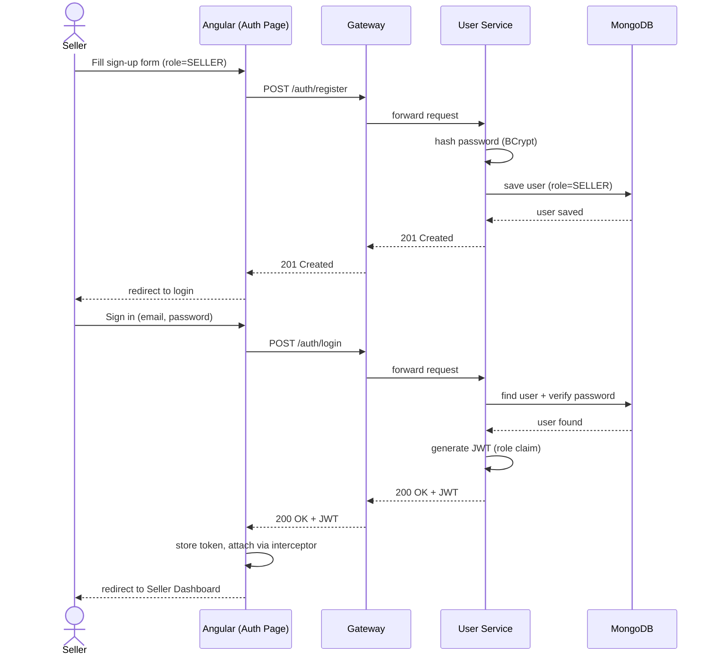
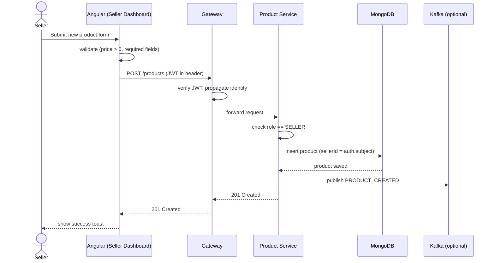
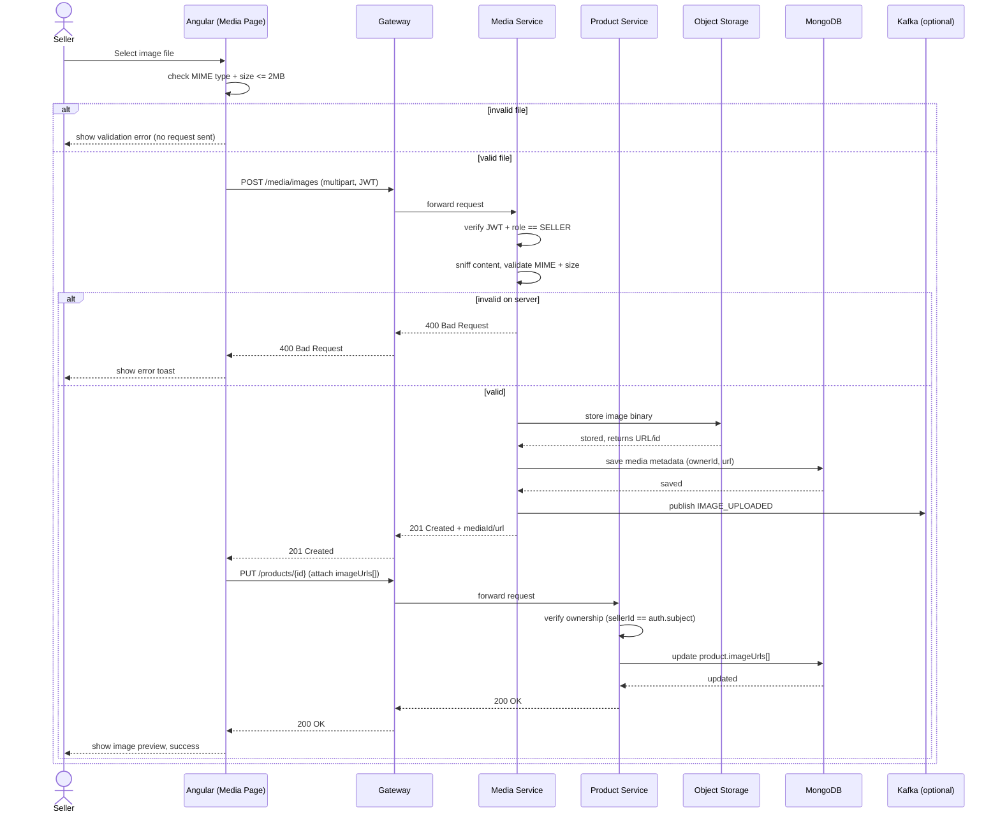
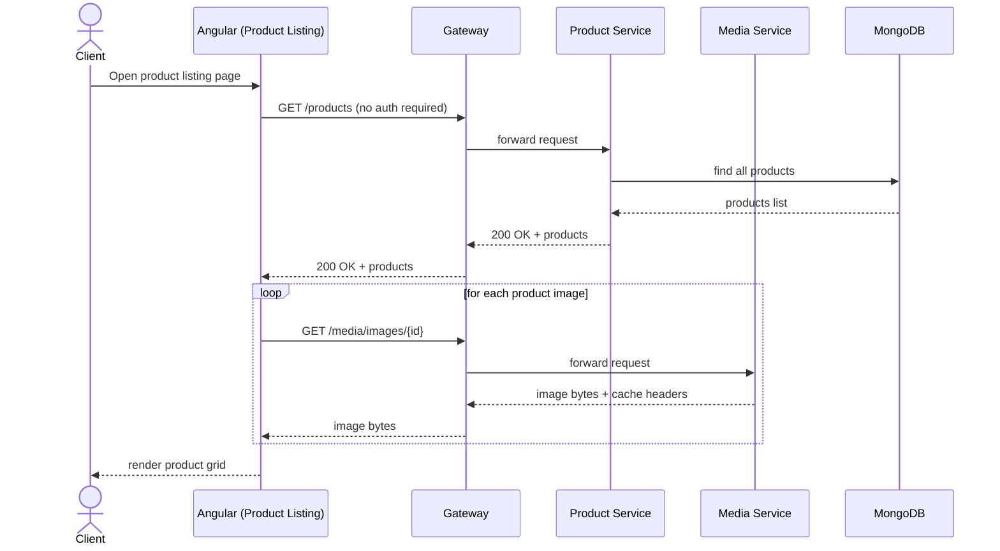
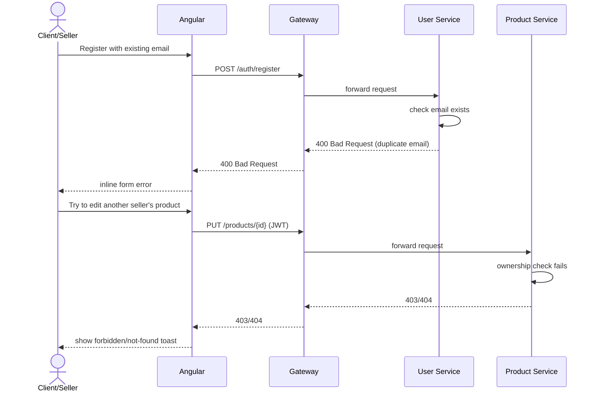

# Buy01 — Sequence Diagrams

## 1. Sequence Diagrams

### 1.1 Seller Registration & Login

### 1.2 Seller — Create Product

### 1.3 Seller — Upload & Attach Media

### 1.4 Client — Browse Products (Public)

### 1.5 Error Handling — Duplicate Email / Forbidden Action

